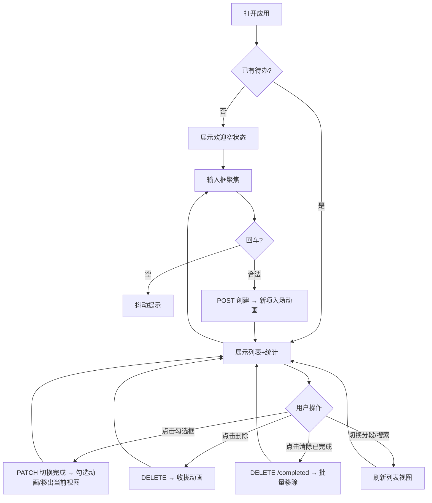
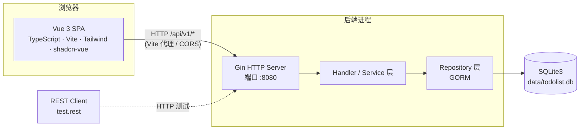
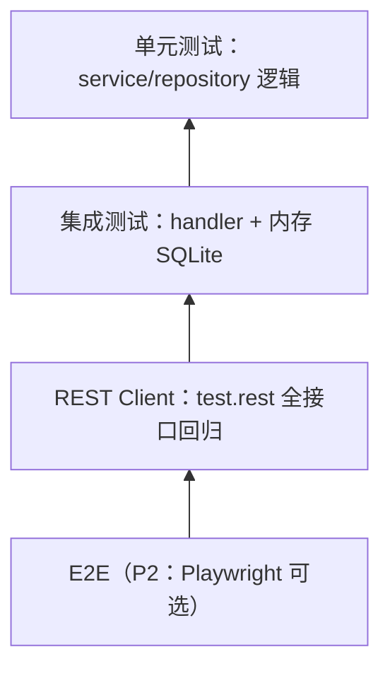

# Todo List — 待办事项应用 · 需求与设计文档（PRD & Design Spec）

| 项目 | 内容 |
| --- | --- |
| 文档编号 | 0001 |
| 文档名称 | Todo List 待办事项应用需求与设计文档 |
| 版本 | v0.1.0（初稿，待评审） |
| 状态 | Draft / 评审中 |
| 作者 | 产品 + 研发 |
| 日期 | 2025-01-01 |
| 适用范围 | 前后端开发、测试、验收、后续迭代 |

> **一句话定位**：Todo List 是一个**单用户、本地优先**的极简待办事项应用 —— 界面遵循 Apple 官网设计语言（干净、留白、圆润、克制的动效），后端使用 Go/Gin/GORM + SQLite3，前端使用 Vue 3 + TypeScript + Vite + Tailwind CSS + shadcn-vue，通过 Makefile 统一管理生命周期，通过 REST Client（`.rest` 文件）验证全部 REST API。

---

## 修订记录

| 版本 | 日期 | 修订人 | 说明 |
| --- | --- | --- | --- |
| v0.1.0 | 2026-08-27 | 陈晓会 | 初稿：完整需求分析、UI/UX 设计、系统设计、接口设计、数据库设计、测试策略、里程碑 |

---

## 目录

1. [项目概述](#1-项目概述)
2. [术语表](#2-术语表)
3. [需求分析](#3-需求分析)
4. [产品设计（UI/UX · Apple 风格）](#4-产品设计uiux--apple-风格)
5. [系统架构](#5-系统架构)
6. [后端设计](#6-后端设计)
7. [数据库设计](#7-数据库设计)
8. [前端设计](#8-前端设计)
9. [生命周期管理（Makefile）](#9-生命周期管理makefile)
10. [测试策略](#10-测试策略)
11. [里程碑与任务拆分](#11-里程碑与任务拆分)
12. [风险与对策](#12-风险与对策)
13. [验收标准（Definition of Done）](#13-验收标准definition-of-done)
14. [附录](#14-附录)

---

## 1. 项目概述

### 1.1 背景与目标

日常事务繁杂，需要一款**打开即用、无需注册、轻量快速**的待办工具。市面应用多需要账号体系、云端同步、订阅付费，对"只想快速记下一件事并打勾"的场景过重。

**目标**：构建一个本地运行的 Web 待办应用：

- 无需用户系统，打开即可用；
- 支持创建 / 删除 / 完成 / 取消完成待办事项；
- 交互与视觉对标 Apple 官网设计语言，做到"**好看、好用、有质感**"；
- 全链路工程化：Makefile 管理生命周期，REST Client 测试 API，代码规范与测试齐备。

### 1.2 产品定位

| 维度 | 说明 |
| --- | --- |
| 产品形态 | 单页 Web 应用（SPA）+ 本地 REST API + 本地 SQLite 数据库 |
| 部署形态 | 本地开发机 / 内网单机运行，单进程 |
| 使用人数 | 单用户（无账号体系，无多用户数据隔离需求） |
| 设计基调 | Apple 官网风格：极简、大留白、细腻动效、深浅色双主题 |
| 数据安全 | 数据保存在本地 SQLite 文件中，不联网同步（MVP） |

### 1.3 目标用户与使用场景

- **开发者本人**：在本机 `make dev` 一键起服务，随手记录任务；
- **轻量个人用户**：无注册门槛，浏览器打开即用；
- **学习示例**：作为 Go + Vue 全栈工程的最佳实践示范项目（分层、测试、Makefile、REST Client 测试全覆盖）。

典型使用场景：

1. 打开应用 → 输入框自动聚焦 → 输入"给产品写周报" → 回车 → 任务出现；
2. 完成一项 → 点击圆形勾选框 → 任务划线变灰 → 完成数 +1；
3. 误点或改主意 → 再次点击取消完成；
4. 任务不需要了 → 悬停出现删除按钮 → 点击删除；
5. 积压太多已完成 → 一键"清除已完成"。

### 1.4 范围（In Scope / Out of Scope）

**本期（MVP）范围内：**

- 待办事项的增 / 删 / 改（标题）/ 查（列表、详情、筛选、搜索、分页）；
- 完成 / 取消完成（含完成时间记录）；
- 一键清除已完成；
- 深浅色主题、响应式布局、基础动效；
- Makefile 生命周期管理（初始化、开发、构建、运行、测试、清理等）；
- REST Client（`test.rest`）全 API 测试 + 后端单元测试。

**本期范围外（明确不做）：**

- 用户系统、登录注册、权限、多用户；
- 云同步、多端同步、账号数据迁移；
- 截止日期、提醒通知、重复任务、标签、优先级；
- 任务拖拽排序（列入 P2 增强项，见 §14.2）；
- 附件、富文本、协同编辑；
- 移动端原生 App（仅做响应式 Web）。

### 1.5 成功指标

| 指标 | 目标 |
| --- | --- |
| 创建一条待办 | ≤ 2 次操作（聚焦输入 → 回车） |
| 完成 / 取消完成 | ≤ 1 次点击 |
| 删除一条待办 | ≤ 2 次操作 |
| 列表接口 p95 延迟 | < 100ms（万级数据量内） |
| API 测试覆盖率 | 后端 handler 层 ≥ 80%，全部接口均被 `test.rest` 覆盖 |
| 首屏可交互时间 | < 1.5s（本地环境） |
| 无障碍 | 键盘可完成全部操作，对比度满足 WCAG AA |

---

## 2. 术语表

| 术语 | 英文 | 说明 |
| --- | --- | --- |
| 待办 | Todo / Todo Item | 一条待办事项，含标题、完成状态、时间信息 |
| 进行中 | Active | 未完成状态的待办 |
| 已完成 | Completed | 已完成状态的待办 |
| 清除已完成 | Clear Completed | 批量删除全部已完成待办的操作 |
| 生命周期 | Lifecycle | 项目从初始化、开发、测试、构建、运行到清理的完整流程，由 Makefile 编排 |
| REST Client | REST Client | VS Code 插件（humao.rest-client），通过 `.rest`/`.http` 文件直接发送并验证 HTTP 请求 |
| 响应信封 | Response Envelope | 统一的 JSON 响应包装结构 `{ code, message, data, meta }` |
| 深色模式 | Dark Mode | 与系统/手动切换的深色主题 |
| 毛玻璃 | Frosted Glass | `backdrop-filter: blur()` 实现的半透明模糊效果 |

---

## 3. 需求分析

### 3.1 用户故事（User Stories）

| 编号 | 角色 | 故事 | 优先级 |
| --- | --- | --- | --- |
| US-01 | 用户 | 我想输入文字并回车，快速创建一条待办 | P0 |
| US-02 | 用户 | 我想查看全部待办，并能按"进行中 / 已完成"筛选 | P0 |
| US-03 | 用户 | 我想点击勾选框完成一项待办，再点一次取消完成 | P0 |
| US-04 | 用户 | 我想删除某条不再需要的待办 | P0 |
| US-05 | 用户 | 我想一键清空所有已完成待办 | P0 |
| US-06 | 用户 | 我想看到还剩多少未完成，获得掌控感 | P0 |
| US-07 | 用户 | 我想双击标题修改措辞 | P1 |
| US-08 | 用户 | 我想用关键词搜索待办 | P1 |
| US-09 | 用户 | 我想在夜间使用不刺眼的深色主题 | P0 |
| US-10 | 用户 | 我想知道每条待办创建/完成的时间 | P1 |
| US-11 | 用户 | 误删后我想能撤销删除 | P2 |

### 3.2 功能需求（FR）

> 优先级定义：**P0**（MVP 必须）/ **P1**（本期尽量，可滚动）/ **P2**（下期）。

#### FR-01 创建待办（P0）

| 项 | 内容 |
| --- | --- |
| 描述 | 用户在输入框填写标题，回车或点击"+"创建一条待办 |
| 规则 | 标题去除首尾空白后长度必须为 1~200 字符；为空则不创建并给出轻微抖动提示；创建成功清空输入框并保持聚焦 |
| 数据 | 标题、创建时间、更新时间；完成状态默认 `false` |
| 验收 | ① 回车创建成功，列表顶部出现新项，计数 +1；② 输入纯空格回车不创建；③ 输入 201 字符被拒绝（前端截断/提示 + 后端 400 兜底） |

#### FR-02 查看待办列表（P0）

| 项 | 内容 |
| --- | --- |
| 描述 | 展示全部待办，支持状态筛选、关键词搜索、分页与排序 |
| 筛选 | `all`（全部）/ `active`（进行中）/ `completed`（已完成）三个视图 |
| 排序 | 默认按创建时间倒序；可切换为按更新时间、完成时间排序 |
| 分页 | 默认 20 条/页，支持翻页（MVP 前端可只加载第一页，滚动加载为 P2） |
| 验收 | ① 三种筛选视图数据正确；② 每个视图头部显示对应数量角标；③ 分页元信息（total/page/pageSize）正确 |

#### FR-03 完成 / 取消完成（P0）

| 项 | 内容 |
| --- | --- |
| 描述 | 点击待办行左侧圆形勾选框切换完成状态 |
| 规则 | 完成时：写入 `completed=true` 与 `completedAt`；取消时：`completed=false` 且 `completedAt` 置空 |
| 视觉 | 完成项标题加删除线、颜色变淡；勾选框填充主题蓝并播放勾选描边动画 |
| 验收 | ① 点击后状态即时更新（乐观更新，失败回滚并 toast 报错）；② 在"已完成"视图取消完成后，该项移出当前视图；③ 重新加载页面状态保持一致 |

#### FR-04 删除待办（P0）

| 项 | 内容 |
| --- | --- |
| 描述 | 删除单条待办 |
| 交互 | 桌面端：行悬停显示删除按钮；移动端：常显。点击后直接删除（不弹确认框，符合 Apple 风格），删除动画为高度收缩 + 淡出 |
| 规则 | MVP 为物理删除（P2 升级软删除 + 撤销，见 §14.2） |
| 验收 | ① 删除成功，列表与计数同步更新；② 删除不存在的 id 返回 404；③ 删除动画流畅 |

#### FR-05 清除已完成（P0）

| 项 | 内容 |
| --- | --- |
| 描述 | 一键删除全部已完成待办 |
| 交互 | 列表底部"清除已完成 (N)"按钮，仅在 N>0 时显示；点击后批量删除 |
| 验收 | ① 全部已完成项被删除；② 未完成项不受影响；③ 按钮随 N 变为 0 自动隐藏 |

#### FR-06 编辑标题（P1）

| 项 | 内容 |
| --- | --- |
| 描述 | 双击标题进入行内编辑，回车保存 / Esc 取消 / 失焦保存 |
| 规则 | 同 FR-01 的标题校验（1~200 字符） |
| 验收 | ① 双击可编辑；② 修改后刷新持久化；③ 非法输入提示且不保存 |

#### FR-07 筛选与统计（P0）

| 项 | 内容 |
| --- | --- |
| 描述 | 分段控件（Segmented Control）切换 全部 / 进行中 / 已完成，各段显示数量角标；底部显示"还剩 N 项未完成" |
| 验收 | ① 角标数字与后端统计一致；② 切换视图保留当前关键词（若有） |

#### FR-08 搜索（P1）

| 项 | 内容 |
| --- | --- |
| 描述 | 顶部搜索框（`⌘K` / `Ctrl+K` 聚焦），按标题模糊匹配 |
| 验收 | ① 输入即搜（300ms 防抖）；② 与状态筛选可叠加；③ 无结果展示"未找到相关待办"空状态 |

#### FR-09 深色模式（P0）

| 项 | 内容 |
| --- | --- |
| 描述 | 支持"跟随系统 / 浅色 / 深色"三态切换，头部提供切换控件 |
| 实现 | Tailwind `dark` 类策略 + CSS 变量令牌；选择持久化到 `localStorage`；首屏内联脚本避免闪烁（FOUC） |
| 验收 | ① 三种模式切换即时生效且无闪烁；② 所有组件（含动效、占位、滚动条）在深色下视觉协调 |

### 3.3 非功能需求（NFR）

| 编号 | 类别 | 需求 |
| --- | --- | --- |
| NFR-01 | 性能 | 单用户场景：列表接口 p95 < 100ms（≤ 10 万条数据）；前端列表 ≥ 200 项时启用虚拟滚动（P2）；静态资源按需分包 |
| NFR-02 | 可用性 | 服务异常时前端给出友好错误提示（toast），不白屏；输入内容不因刷新丢失（创建中的文案保留在输入框） |
| NFR-03 | 兼容性 | 桌面：Chrome / Edge / Safari / Firefox 最近 2 个大版本；移动：iOS Safari / Android Chrome；最小支持宽度 375px；`prefers-reduced-motion` 时降级动画 |
| NFR-04 | 安全 | 无用户系统、无敏感数据；后端做输入校验与长度限制；前端不渲染 HTML（防 XSS）；CORS 白名单可配置；SQLite 数据文件默认 0600 权限 |
| NFR-05 | 可维护性 | 后端分层（handler/service/repository）；统一错误处理与日志；golangci-lint + ESLint + Prettier 全绿；Makefile 目标幂等可重入 |
| NFR-06 | 可测试性 | repository 层依赖注入（可换内存 SQLite）；handler 层可独立单测；全部 API 在 `test.rest` 中可复现 |
| NFR-07 | 可访问性 | 键盘可完成全部操作；焦点可见（focus-visible 环）；对比度达 WCAG AA；关键元素提供 `aria-label` |

---

## 4. 产品设计（UI/UX · Apple 风格）

> "Think ultra hard" 的结果：本方案逐项对照 Apple HIG 与 apple.com 官网的视觉语言，把"留白、层级、质感、动效"做成显式的设计规范，而不是随缘的 CSS。

### 4.1 设计原则

1. **少即是多**：单页、单主操作（创建），一切非必要元素让位。
2. **内容即界面**：不堆卡片边框，用留白与字体层级区分内容。
3. **克制的动效**：动效服务于反馈（勾选、删除、入场），200~400ms，缓动统一，绝不做炫技动画。
4. **触手可及**：主操作 ≤2 次点击，键盘全程可用。
5. **双主题一致**：明暗两套令牌共享同一套布局与间距体系。

### 4.2 视觉规范（Design Tokens）

#### 4.2.1 色彩

| 令牌 | 浅色 | 深色 | 用途 |
| --- | --- | --- | --- |
| `--bg` | `#FFFFFF` | `#000000` | 页面背景 |
| `--bg-elevated` | `#F5F5F7` | `#1C1C1E` | 卡片 / 分段控件 / 页脚底 |
| `--text-primary` | `#1D1D1F` | `#F5F5F7` | 主标题、正文 |
| `--text-secondary` | `#6E6E73` | `#A1A1A6` | 说明文字、时间戳 |
| `--text-tertiary` | `#86868B` | `#6E6E73` | 占位符、禁用 |
| `--accent` | `#0071E3` | `#0A84FF` | 主操作色（Apple 蓝） |
| `--success` | `#34C759` | `#30D158` | 完成态 |
| `--danger` | `#FF3B30` | `#FF453A` | 删除、错误 |
| `--border` | `rgba(0,0,0,0.08)` | `rgba(255,255,255,0.12)` | 分隔线、描边 |
| `--frosted` | `rgba(255,255,255,0.72)` | `rgba(22,22,24,0.72)` | 毛玻璃头部/背景 |

> 说明：`#F5F5F7`、`#1D1D1F`、`#0071E3`、`#0A84FF` 均为 Apple 官方系统色；所有颜色以 CSS 变量暴露，Tailwind 通过 `hsl(var(--token))` 引用，深浅模式切换只改变量。

#### 4.2.2 字体排印

- 字体栈：`-apple-system, BlinkMacSystemFont, "SF Pro Display", "SF Pro Text", "PingFang SC", "Helvetica Neue", "Microsoft YaHei", sans-serif`；
- 大标题使用负字距（`letter-spacing: -0.02em ~ -0.03em`），这是 Apple 大标题的辨识特征；
- 字号阶梯（浅色/深色通用）：

| 级别 | 字号 / 行高 | 字重 | 用途 |
| --- | --- | --- | --- |
| display | 40~48 / 1.1 | 700 | 页面 Hero 标题（如"今天"） |
| title-2 | 28 / 1.2 | 700 | 区块标题 |
| headline | 17 / 1.4 | 600 | 待办标题 |
| body | 15~17 / 1.5 | 400 | 正文 |
| footnote | 13 / 1.4 | 400 | 时间戳、统计 |
| caption | 11 / 1.3 | 500 | 角标、徽章 |

#### 4.2.3 间距 / 圆角 / 阴影

- 间距基准 4px：`4/8/12/16/20/24/32/48/64/96`；页面内容列最大宽 `672px`（`max-w-2xl`），两侧大量留白；
- 圆角：输入框/按钮 `9999px`（胶囊），卡片 `16px`，勾选框 `6px`（Apple 式圆角方框），分段控件 `10px`；
- 阴影：常规 `0 4px 16px rgba(0,0,0,0.06)`；悬停 `0 8px 24px rgba(0,0,0,0.10)`；深色下阴影透明度减半；
- 边框：`1px solid var(--border)` 仅用于分隔与轻描边，卡片主体靠"背景 + 圆角"区分。

#### 4.2.4 动效

| 场景 | 时长 | 曲线 | 说明 |
| --- | --- | --- | --- |
| 元素入场（列表项） | 300ms | `cubic-bezier(0.32, 0.72, 0, 1)`（Apple 弹簧近似） | 位移 8px → 0 + 淡入，相邻项间隔 40ms 错峰 |
| 勾选动画 | 250ms | 同上 | SVG check 描边 `stroke-dashoffset` 绘制 + 圆框填充 |
| 删除 | 250ms | `cubic-bezier(0.4, 0, 0.2, 1)` | 高度收缩 + 透明度归零（`FLIP` 实现，后续项平滑上移） |
| 悬停 | 150ms | `ease-out` | 行背景微亮、删除按钮淡入、轻微 `scale(1.01)` |
| 分段控件切换 | 200ms | `ease` | 高亮滑块平滑滑动（`layout` 动画） |
| toast 出现/消失 | 250ms | 同上 | 底部滑入 + 淡出 |
| 页面切换/首次加载 | 400ms | Apple 曲线 | 内容整体淡入 |

- 所有动效尊重 `prefers-reduced-motion: reduce`：直接禁用位移类动画，保留必要淡入。

### 4.3 信息架构与页面布局

单页布局（桌面端，内容列居中 `max-w-2xl`）：

```
┌────────────────────────────────────────────────────────┐
│ ░ 毛玻璃固定头部（backdrop-blur + 半透明）              │
│   ◐ Todo List                  [🌙/☀️ 主题切换]          │
├────────────────────────────────────────────────────────┤
│                    今天，1月1日 星期三                     │  ← Hero 大标题
│             还剩 5 项 · 已完成 7 项 · 全部 12 项          │  ← 摘要（文案型）
│                                                          │
│   ┌────────────────────────────────────────────────┐    │
│   │ ✚  添加一项待办…                        ⌘K 搜索 │    │  ← 胶囊输入框（大）
│   └────────────────────────────────────────────────┘    │
│                                                          │
│   [ 全部 12 ] [ 进行中 5 ] [ 已完成 7 ]                  │  ← 分段控件
│                                                          │
│   ┌────────────────────────────────────────────────┐    │
│   │  ◯  学习 Go 语言基础                    🗑  10:00 │    │  ← 待办行
│   ├────────────────────────────────────────────────┤    │
│   │  ◯  给产品写周报                        🗑  09:41 │    │
│   ├────────────────────────────────────────────────┤    │
│   │  ☑︎  整理报销单据                    🗑  昨天     │    │  ← 已完成：划线+变灰
│   └────────────────────────────────────────────────┘    │
│                                                          │
│   还剩 5 项未完成                    [ 清除已完成 (7) ]   │  ← 页脚
│                                                          │
│   （空状态/加载骨架在此区域按状态切换）                     │
└────────────────────────────────────────────────────────┘
```

关键布局决策：

- **单一内容列 + 大留白**：还原 apple.com 的"呼吸感"；左右留白在 ≥1024px 时≥ 96px；
- **毛玻璃头部**：滚动时头部 `position: sticky` + `backdrop-filter: blur(20px)`，内容从下方"穿"过，是 Apple 官网标志性交互；
- **分段控件替代 Tabs**：iOS 原生观感，高亮滑块随选中项滑动；
- **行内操作前置**：删除按钮常驻悬停态，不抢占视觉焦点；
- **文案型统计**：用自然语言（"还剩 5 项"）替代冷冰冰的数字标签，更 Apple。

### 4.4 交互细节（Interaction Spec）

| # | 交互 | 规范 |
| --- | --- | --- |
| I-1 | 创建 | 页面加载自动聚焦输入框；输入中按回车创建；输入法中文组词中（`compositionstart`~`compositionend`）不触发提交；创建成功后输入框清空并**重新聚焦**，便于连续录入 |
| I-2 | 空输入 | trim 后为空：不创建，输入框做一次 300ms 水平抖动并保留焦点 |
| I-3 | 完成/取消 | 点击圆形勾选框；完成瞬间播放勾选动画；乐观更新 UI，接口失败则回滚并 toast"操作失败"；完成后若当前视图为"进行中"，该项以收拢动画移出列表 |
| I-4 | 删除 | 桌面 hover 显示删除按钮（淡入 150ms）；点击即删并播放收拢动画；删除成功 toast 提示（P2 升级为"已删除 + 撤销"） |
| I-5 | 编辑（P1） | 双击标题进入行内编辑，`Enter` 保存、`Esc` 取消、失焦保存；保存失败保留编辑态并提示 |
| I-6 | 搜索（P1） | `⌘K` / `Ctrl+K` 聚焦搜索框；输入 300ms 防抖；Esc 清空并失焦 |
| I-7 | 键盘无障碍 | 列表项可 `Tab` 聚焦；聚焦时 `Space` 切换完成、`Delete`/`Backspace` 删除 |
| I-8 | 清除已完成 | 仅当 N>0 显示；点击后按钮短暂 loading，完成后列表收拢更新 |
| I-9 | 错误反馈 | 网络/服务错误统一 toast（顶部居中，浅色白底/深色黑底，`role="alert"`）；不做阻塞式弹窗 |
| I-10 | 数据刷新 | 所有写操作成功后以返回数据做本地合并（不整页重拉），保证动画连续；页面 `visibilitychange` 回前台时静默刷新一次（P1） |

### 4.5 空状态与加载

| 状态 | 展示 |
| --- | --- |
| 首次使用（无任何待办） | 居中的 🫧 图标 + "欢迎使用 Todo List" + "在上面输入一条待办开始吧" |
| 筛选无结果 | 居中图标 + "这里空空如也"（+ "清除搜索条件"按钮，若处于搜索态） |
| 加载中 | 3 行骨架屏（shadcn Skeleton，浅灰圆角块，微呼吸闪烁），避免白屏跳动 |
| 接口错误 | 居中错误提示 + "重试"按钮 |

### 4.6 响应式与无障碍

- **375px（iPhone SE）**：头部收窄、输入框图标隐藏只留文案、删除按钮常显、字号阶梯整体 -2px；
- **768px**：分段控件保持可横向滚动；
- **≥1024px**：展示完整 Hero 大标题与 hover 交互；
- 触屏设备点击目标 ≥ 44×44pt（勾选框、删除按钮均达标）；
- 焦点环：`focus-visible` 显示 2px 主题色描边，鼠标操作不显示；
- 对比度：正文 #1D1D1F 在 #FFFFFF 上 ≥ 12:1；次级文本 #6E6E73 ≥ 4.5:1，满足 WCAG AA；
- 语义化：使用 `<main>`、`<ul><li>`、`aria-pressed`（分段控件）、`aria-live="polite"`（统计数字变化）。

### 4.7 用户流程



---

## 5. 系统架构

### 5.1 总体架构



- 前后端分离部署：前端开发时由 Vite（:5173）代理 `/api` 到后端（:8080），生产构建后由后端静态托管 `web/dist`（单一进程部署，简化运维）；
- 数据层仅后端访问 SQLite，前端永不直连数据库。

### 5.2 技术选型与理由

| 层 | 选型 | 版本 | 理由 | 备选 |
| --- | --- | --- | --- | --- |
| 后端语言 | Go | ≥ 1.26.1 | 单二进制部署、并发模型契合 HTTP、构建快 | — |
| Web 框架 | Gin | v1.x | 生态成熟、中间件丰富、性能好、文档全 | Echo / Fiber |
| ORM | GORM | v2.0.0 | 结构体映射直观、自带迁移与软删除、社区大 | sqlx / Ent |
| SQLite 驱动 | `glebarez/sqlite` | 最新 | **纯 Go 实现，无 CGO**，避免交叉编译/CI 环境安装 gcc 的坑（详见 §12 风险 R-1） | `gorm.io/driver/sqlite`（mattn，需 CGO） |
| 前端框架 | Vue 3 + TypeScript | ^3.5 | 组合式 API 简洁、类型安全、模板直观 | React |
| 构建工具 | Vite | ^5/6 | 秒级 HMR、原生 ESM、内置代理 | Webpack |
| 样式 | Tailwind CSS | ^3.4 | 原子类 + 设计令牌体系，契合 Apple 快速定制 | UnoCSS |
| 组件库 | shadcn-vue | 最新 | 无运行时依赖、源码复制进项目可完全定制（**利于实现 Apple 风格而非常规后台风**）、无障碍好 | Naive UI / Element Plus |
| 状态管理 | Pinia | ^2 | 官方推荐、DevTools 友好、store 拆分清晰 | 组合式函数自研 |
| HTTP 客户端 | Axios | ^1 | 拦截器统一错误处理/超时，TS 类型好 | fetch 封装 |
| 测试（后端） | testing + testify | — | 标准库为主，testify 断言简洁 | — |
| 测试（前端） | Vitest + Vue Test Utils | — | 与 Vite 同构、零配置 | Jest |
| API 验证 | REST Client（VS Code 插件） | 最新 | `.rest` 文件即文档即测试，支持变量与请求链 | HttpYac / Postman |
| 工程化 | Makefile | — | 生命周期集中编排、目标幂等、跨平台（优先 GNU Make） | Taskfile / 脚本 |

### 5.3 项目目录结构

```text
todolist/
├── Makefile                     # 生命周期入口（唯一入口，见 §9）
├── README.md                    # 项目说明 + 快速开始
├── .gitignore                   # 忽略构建产物与数据库文件
├── .env.example                 # 环境变量样例
├── spec/
│   ├── Instruction.md           # 任务说明
│   └── 0001-prd-spec.md         # 本文档
├── server/                      # —— Go 后端 ——
│   ├── go.mod / go.sum
│   ├── cmd/
│   │   ├── api/main.go          # 服务入口：加载配置→连接DB→迁移→注册路由→启动
│   │   └── seed/main.go         # 演示数据注入（make seed）
│   ├── internal/
│   │   ├── config/config.go     # 环境变量配置（PORT/DB_PATH/GIN_MODE/ORIGINS）
│   │   ├── model/todo.go        # Todo 数据模型
│   │   ├── repository/todo.go   # 数据访问层（接口 + GORM 实现）
│   │   ├── service/todo.go      # 业务逻辑层（校验、组装）
│   │   ├── handler/todo.go      # HTTP 层（参数绑定、响应封装）
│   │   ├── handler/response.go  # 统一响应信封与错误码
│   │   ├── middleware/cors.go   # CORS
│   │   ├── middleware/logger.go # 访问日志（gin.Logger + 自定义格式）
│   │   ├── middleware/recovery.go# panic 恢复，返回 500 信封
│   │   └── router/router.go     # 路由注册
│   ├── test.rest                # REST Client 全接口测试（见 §10.3）
│   └── internal/**/*_test.go    # 单元/集成测试
└── web/                         # —— Vue 前端 ——
    ├── package.json / pnpm-lock.yaml
    ├── vite.config.ts           # 含 /api 代理、路径别名、构建分包
    ├── tsconfig.json
    ├── tailwind.config.ts       # 设计令牌 → Tailwind 扩展
    ├── index.html               # 含防 FOUC 主题脚本
    ├── components.json          # shadcn-vue 配置
    └── src/
        ├── main.ts / App.vue
        ├── assets/              # 全局样式（design-tokens.css 等）
        ├── api/todo.ts          # Axios 封装 + Todo API 函数
        ├── types/todo.ts        # Todo / TodoQuery / PageResult 类型
        ├── stores/todo.ts       # Pinia store（列表/筛选/统计/乐观更新）
        ├── composables/         # 复用逻辑（如 useTheme）
        ├── components/          # shadcn-vue 基础组件（button/input/toast…）
        ├── features/todo/       # 业务组件
        │   ├── TodoInput.vue
        │   ├── TodoItem.vue
        │   ├── TodoList.vue
        │   ├── TodoSegmented.vue
        │   └── TodoFooter.vue
        └── __tests__/           # Vitest 测试
```

---

## 6. 后端设计

### 6.1 API 总览

统一前缀：`/api/v1`。健康检查：`GET /healthz`（前缀外）。

| 方法 | 路径 | 说明 | 优先级 |
| --- | --- | --- | --- |
| GET | `/api/v1/todos` | 查询待办列表（筛选/搜索/分页/排序） | P0 |
| POST | `/api/v1/todos` | 创建待办 | P0 |
| GET | `/api/v1/todos/:id` | 查询单条待办 | P0 |
| PATCH | `/api/v1/todos/:id` | 更新待办（标题 / 完成状态） | P0 |
| DELETE | `/api/v1/todos/:id` | 删除单条待办 | P0 |
| DELETE | `/api/v1/todos/completed` | 清除全部已完成待办 | P0 |

> 路由冲突说明：Gin 的 httprouter 对静态路由（`/todos/completed`）的优先级高于参数路由（`/todos/:id`），因此两者可共存；但**必须在注册参数路由之前注册静态路由**，并在测试用例中覆盖（见 §12 风险 R-2）。

### 6.2 通用约定

**URL 与资源**：全部走 RESTful 风格，资源名为复数 `todos`；`id` 为正整数。

**HTTP 状态码**：

| 状态码 | 场景 |
| --- | --- |
| 200 | 查询 / 更新成功 |
| 201 | 创建成功（响应含 Location 头） |
| 204 | 删除成功（无响应体） |
| 400 | 参数校验失败（业务码 400xx） |
| 404 | 资源不存在（业务码 40400） |
| 405 | 方法不允许 |
| 500 | 服务器内部错误（业务码 500xx） |

**统一响应信封**：

```json
{ "code": 0, "message": "ok", "data": { }, "meta": { } }
```

- `code`：业务码，`0` 表示成功；非 0 时 `data` 为 `null`；
- `message`：人类可读信息（中文，可直接展示）；
- `data`：业务数据（对象 / 数组 / null）；
- `meta`：分页等元信息（无则 `null`）。

**错误码表**：

| code | HTTP | 含义 |
| --- | --- | --- |
| 0 | 200/201 | 成功 |
| 40000 | 400 | 请求参数错误（通用） |
| 40001 | 400 | 标题为空或超长（1~200） |
| 40002 | 400 | 分页参数非法（page ≥ 1；pageSize 1~100） |
| 40003 | 400 | 排序参数非法（field 或方向不支持） |
| 40004 | 400 | id 不是合法正整数 |
| 40400 | 404 | 待办不存在 |
| 50000 | 500 | 服务器内部错误 |
| 50001 | 500 | 数据库操作失败 |

**日期格式**：一律 RFC3339（如 `2025-01-01T10:00:00Z`），数据库以 UTC 存储，展示由前端本地化。

**分页约定**：`page`（≥1，默认 1）、`pageSize`（1~100，默认 20）；响应 `meta` 返回 `{ page, pageSize, total, totalPages }`。

**排序约定**：`sort=field:direction`，`field ∈ {createdAt, updatedAt, completedAt}`，`direction ∈ {asc, desc}`，默认 `createdAt:desc`；多字段用 `,` 分隔（如 `sort=completed:asc,createdAt:desc`）。

### 6.3 接口详细定义

#### 6.3.1 `GET /api/v1/todos` — 查询列表

**Query 参数**：

| 参数 | 类型 | 必填 | 默认 | 说明 |
| --- | --- | --- | --- | --- |
| `status` | string | 否 | `all` | `all` / `active` / `completed` |
| `q` | string | 否 | — | 标题模糊搜索（≤100 字符，`LIKE '%q%'`） |
| `page` | int | 否 | 1 | 页码，≥1 |
| `pageSize` | int | 否 | 20 | 每页条数，1~100 |
| `sort` | string | 否 | `createdAt:desc` | 排序，见 §6.2 |

**成功响应 200**：

```json
{
  "code": 0,
  "message": "ok",
  "data": [
    {
      "id": 1,
      "title": "学习 Go 语言",
      "completed": false,
      "createdAt": "2025-01-01T10:00:00Z",
      "updatedAt": "2025-01-01T10:00:00Z",
      "completedAt": null
    }
  ],
  "meta": { "page": 1, "pageSize": 20, "total": 42, "totalPages": 3 }
}
```

**错误**：`40002`（分页非法）、`40003`（排序非法）。

#### 6.3.2 `POST /api/v1/todos` — 创建待办

**请求体**：

```json
{ "title": "给产品写周报" }
```

| 字段 | 类型 | 必填 | 校验 |
| --- | --- | --- | --- |
| `title` | string | 是 | trim 后 1~200 字符 |

**成功响应 201**（`Location: /api/v1/todos/2`）：

```json
{
  "code": 0,
  "message": "ok",
  "data": {
    "id": 2, "title": "给产品写周报", "completed": false,
    "createdAt": "2025-01-01T10:00:00Z", "updatedAt": "2025-01-01T10:00:00Z",
    "completedAt": null
  }
}
```

**错误**：`40001`（空/超长标题）、`50001`（写库失败）。

#### 6.3.3 `GET /api/v1/todos/:id` — 查询单条

**成功响应 200**：`data` 为单个待办对象（结构同上）。

**错误**：`40004`（id 非法）、`40400`（不存在）。

#### 6.3.4 `PATCH /api/v1/todos/:id` — 更新待办（PATCH 语义：仅更新提供的字段）

**请求体**（至少一个字段）：

```json
{ "title": "给产品写周报（加急）", "completed": true }
```

| 字段 | 类型 | 校验 | 说明 |
| --- | --- | --- | --- |
| `title` | string | trim 后 1~200 | 修改标题 |
| `completed` | boolean | — | `true`：完成，写 `completedAt`；`false`：取消完成，`completedAt` 置空 |

**成功响应 200**：`data` 为更新后的完整对象。

**错误**：`40001`（标题非法）、`40004` / `40400`（id 非法/不存在）、`50001`。

> 完成 / 取消完成统一走本接口（`completed` 字段），不单独设 toggle 端点，保持 API 面最小；`test.rest` 中分别用 `true` / `false` 覆盖两个方向。

#### 6.3.5 `DELETE /api/v1/todos/:id` — 删除单条

**成功响应 204**：无响应体。

**错误**：`40004` / `40400`。

#### 6.3.6 `DELETE /api/v1/todos/completed` — 清除已完成

**成功响应 204**；`data` 无。若当前没有已完成项，仍返回 204（幂等）。

**错误**：`50001`。

### 6.4 中间件设计

| 中间件 | 职责 |
| --- | --- |
| `Recovery` | panic 恢复，输出堆栈日志，返回 `{code:50000}` 信封 |
| `Logger` | 访问日志：方法、路径、状态码、耗时、客户端 IP（JSON 行格式） |
| `CORS` | 读取 `ALLOWED_ORIGINS` 环境变量（逗号分隔）；开发默认放行 `http://localhost:5173`；预检请求正确处理 |
| （预留）`RateLimit` | P2：简单令牌桶限流，防误刷 |

### 6.5 数据校验规则汇总

| 字段 | 规则 | 位置 |
| --- | --- | --- |
| `title` | 必填；trim 后 1~200 字符；禁止控制字符 | 后端 service 强制（兜底）+ 前端即时提示 |
| `completed` | 布尔；缺省视为 `false` | 后端 |
| `status` | 枚举白名单 `all/active/completed` | 后端 |
| `page` / `pageSize` | 数值范围如上 | 后端 |
| `sort` | 字段与方向白名单 | 后端 |
| `id` | 正整数 | 后端路由参数解析 |

---

## 7. 数据库设计

### 7.1 SQLite 配置

- 文件：`data/todolist.db`（由 `DB_PATH` 配置，`make clean` 可删除，已加入 `.gitignore`）；
- 连接参数（`glebarez/sqlite` DSN）：

```text
data/todolist.db?_pragma=journal_mode(WAL)&_pragma=busy_timeout(5000)&_pragma=foreign_keys(ON)&_pragma=synchronous(NORMAL)
```

| PRAGMA | 值 | 理由 |
| --- | --- | --- |
| `journal_mode` | WAL | 读写并发更优，崩溃恢复更稳 |
| `busy_timeout` | 5000ms | 避免并发写锁报错 |
| `foreign_keys` | ON | 数据完整性（当前单表亦建议开启） |
| `synchronous` | NORMAL | WAL 下兼顾性能与安全 |

- 连接池：`SetMaxOpenConns(1)`（SQLite 单写者，避免 `database is locked`），`SetMaxIdleConns(1)`。

### 7.2 表结构

**GORM 模型**（`server/internal/model/todo.go`）：

```go
type Todo struct {
    ID          uint       `gorm:"primaryKey" json:"id"`
    Title       string     `gorm:"size:200;not null" json:"title"`
    Completed   bool       `gorm:"not null;default:false;index" json:"completed"`
    CreatedAt   time.Time  `json:"createdAt"`
    UpdatedAt   time.Time  `json:"updatedAt"`
    CompletedAt *time.Time `json:"completedAt,omitempty"`
}
```

**等价 DDL**：

```sql
CREATE TABLE IF NOT EXISTS todos (
    id           INTEGER PRIMARY KEY AUTOINCREMENT,
    title        TEXT    NOT NULL CHECK (length(trim(title)) BETWEEN 1 AND 200),
    completed    INTEGER NOT NULL DEFAULT 0 CHECK (completed IN (0, 1)),
    created_at   DATETIME NOT NULL,
    updated_at   DATETIME NOT NULL,
    completed_at DATETIME
);

CREATE INDEX IF NOT EXISTS idx_todos_completed  ON todos (completed);
CREATE INDEX IF NOT EXISTS idx_todos_created_at ON todos (created_at);
```

设计要点：

- `completed` 用 0/1 而非布尔语义的 TEXT，便于索引与统计；
- `completed_at` 可空，仅完成态有值，为排序/统计预留；
- 标题长度约束在 DB 层 `CHECK` 兜底（双保险）；
- 更新时间 `updated_at` 由 GORM `Update` 自动维护，满足"最近修改排序"。

### 7.3 索引与查询计划

- `idx_todos_completed`：支撑 `WHERE completed=?` 的筛选与计数；
- `idx_todos_created_at`：支撑默认排序 `ORDER BY created_at DESC`；
- 模糊搜索 `LIKE '%q%'` 无法走索引，但单用户数据量级（≤10 万）下全表扫描可接受（p95 < 100ms 目标）；若后续增长，P2 引入 FTS5。

### 7.4 迁移与种子数据

- 迁移：启动时 `db.AutoMigrate(&model.Todo{})`（幂等，足够 MVP）；复杂变更（P2）引入版本化迁移目录；
- 种子：`make seed` 运行 `cmd/seed`，插入 12 条演示待办（含中英文标题、部分已完成），便于开发与 `test.rest` 联调；
- 重置：`make db-reset` 删除 db 文件并重启迁移（开发环境专用）。

---

## 8. 前端设计

### 8.1 工程化配置

**Vite**（`web/vite.config.ts`）：

```ts
export default defineConfig({
  plugins: [vue()],
  resolve: { alias: { '@': fileURLToPath(new URL('./src', import.meta.url)) } },
  server: {
    port: 5173,
    proxy: {
      '/api': { target: 'http://localhost:8080', changeOrigin: true },
      '/healthz': { target: 'http://localhost:8080', changeOrigin: true },
    },
  },
  build: {
    chunkSizeWarningLimit: 600,
    rollupOptions: { output: { manualChunks: { vue: ['vue'], pinia: ['pinia'] } } },
  },
})
```

**Tailwind 令牌接入**（`tailwind.config.ts` 摘要）：

```ts
export default {
  darkMode: 'class',
  theme: {
    extend: {
      colors: {
        bg: 'hsl(var(--bg))',
        elevated: 'hsl(var(--bg-elevated))',
        primary: 'hsl(var(--text-primary))',
        secondary: 'hsl(var(--text-secondary))',
        accent: 'hsl(var(--accent))',
        success: 'hsl(var(--success))',
        danger: 'hsl(var(--danger))',
      },
      borderRadius: { card: '16px', 'pill': '9999px' },
      fontFamily: { sans: [/* Apple 字体栈 */] },
      boxShadow: { card: '0 4px 16px rgba(0,0,0,0.06)', 'card-hover': '0 8px 24px rgba(0,0,0,0.10)' },
      keyframes: { /* 入场/抖动/勾选动画 */ },
    },
  },
}
```

**shadcn-vue**：仅引入并按需定制 `button`、`input`、`skeleton`、`sonner`(toast)、`tooltip` 等基础组件（`components.json` 指向 `src/components`，源码风格 `vue`，主题色映射到上面令牌）。

### 8.2 状态管理与数据流（Pinia）

```ts
// stores/todo.ts（结构示意）
export const useTodoStore = defineStore('todo', {
  state: () => ({
    items: [] as Todo[],          // 当前视图列表
    status: 'all' as FilterStatus,
    keyword: '',
    meta: { page: 1, pageSize: 20, total: 0 } as PageMeta,
    loading: false,
    error: null as string | null,
  }),
  getters: {
    activeCount: (s) => s.items.filter(t => !t.completed).length,
    completedCount: (s) => s.items.filter(t => t.completed).length,
  },
  actions: {
    async fetchList(),   // GET /todos（携带 status/q/sort）
    async create(title), // POST → 乐观插入 + 刷新统计
    async toggle(todo),  // PATCH completed → 乐观更新，失败回滚
    async updateTitle(todo, title), // PATCH title
    async remove(id),    // DELETE → 收拢动画后移除
    async clearCompleted(), // DELETE /completed
  },
})
```

- **乐观更新**：`toggle`/`create`/`remove` 先改本地 state 立即反馈，请求失败回滚 + toast；
- **单一数据源**：统计数字（角标、页脚"还剩 N 项"）全部由 store 派生，不做重复维护；
- **写后合并**：以响应体中的最新对象替换本地项，避免二次请求。

### 8.3 API 客户端封装（`src/api/todo.ts`）

```ts
const http = axios.create({ baseURL: '/api/v1', timeout: 10_000 })

http.interceptors.response.use(
  (res) => res.data,                       // 解包信封，业务 code≠0 时 reject
  (err) => { /* 统一 4xx/5xx → 提取 message → toast */ throw err }
)

export const todoApi = {
  list:   (params: TodoQuery) => http.get<PageResult<Todo>>('/todos', { params }),
  create: (title: string)       => http.post<Todo>('/todos', { title }),
  get:    (id: number)          => http.get<Todo>(`/todos/${id}`),
  patch:  (id: number, p: Partial<Pick<Todo,'title'|'completed'>>) =>
            http.patch<Todo>(`/todos/${id}`, p),
  remove: (id: number)          => http.delete(`/todos/${id}`),
  clearCompleted: ()            => http.delete('/todos/completed'),
}
```

### 8.4 组件树

```text
App.vue
└── <main class="mx-auto max-w-2xl px-4">
    ├── SiteHeader（毛玻璃 sticky / Logo / 主题切换）
    ├── Hero（大标题 + 文案统计）
    ├── TodoInput（胶囊输入框 + ⌘K 搜索框，可折叠）
    ├── TodoSegmented（全部/进行中/已完成 + 角标）
    ├── TodoList
    │   └── TodoItem × N（勾选框 / 标题 / 时间戳 / 删除按钮）
    ├── TodoFooter（还剩 N 项 / 清除已完成）
    └── <Sonner />（toast 出口）
```

### 8.5 主题系统

- `src/assets/design-tokens.css` 定义浅/深两套 CSS 变量（见 §4.2.1）；
- `index.html` 内联脚本：启动时读取 `localStorage['todolist.theme']`（`light|dark|system`），`system` 按 `matchMedia` 解析，在 `<html>` 上预置 `class="dark"`，杜绝 FOUC；
- `useTheme` composable：三态切换 + 持久化 + `system` 变化监听。

### 8.6 动效实现方案

- 列表项入场/移出：`<TransitionGroup>` + FLIP（`v-move` 平滑位移），位移 + 透明度组合；
- 勾选动画：行内内联 SVG，`stroke-dasharray/dashoffset` 过渡；
- 分段控件滑块：绝对定位背景块 + `transition: transform`，宽度由选中项驱动；
- 删除收拢：先测量高度 → `height: 0` + `opacity: 0` → 移除 DOM；
- 全局统一缓动：`--ease-apple: cubic-bezier(0.32, 0.72, 0, 1)`。

---

## 9. 生命周期管理（Makefile）

### 9.1 目标一览

| 目标 | 说明 | 依赖 |
| --- | --- | --- |
| `make help` | 打印全部目标与说明（`awk` 解析注释） | — |
| `make setup` | 初始化：后端 `go mod download` + 前端 `pnpm install` | — |
| `make dev` | 一键启动前后端（后端用 `air` 热重载，前端 `pnpm dev`），Ctrl+C 全部退出 | setup |
| `make dev-api` | 仅启动后端（热重载） | — |
| `make dev-web` | 仅启动前端 | — |
| `make build` | 构建产物：后端二进制 `bin/todolist-server` + 前端 `web/dist` | — |
| `make run` | 以生产模式运行（须先 build；`GIN_MODE=release`，托管 `web/dist`） | build |
| `make test` | 后端全部单测 + 覆盖率（`go test ./... -cover`） | — |
| `make test-web` | 前端 Vitest | — |
| `make test-api` | 运行 `server/test.rest`（见 §9.2 说明） | run |
| `make lint` | `golangci-lint run ./...` + 前端 `pnpm lint` | — |
| `make fmt` | `gofmt -w .` + 前端 `pnpm format`（Prettier） | — |
| `make seed` | 注入演示数据 | — |
| `make db-reset` | 删除数据库文件（开发用） | — |
| `make clean` | 清理构建产物与数据库 | — |

### 9.2 关键片段

```make
# ---- 配置 ----
SERVER_DIR  := server
WEB_DIR     := web
BIN         := bin/todolist-server
PORT        ?= 8080
DB_PATH     ?= data/todolist.db

.PHONY: help setup dev dev-api dev-web build run test test-web test-api lint fmt seed db-reset clean

help:            ## 显示帮助
	@awk 'BEGIN {FS = ":.*##"} /^[a-zA-Z_-]+:.*##/ {printf "  %-14s %s\n", $$1, $$2}' $(MAKEFILE_LIST)

setup:           ## 安装前后端依赖
	cd $(SERVER_DIR) && go mod download
	cd $(WEB_DIR) && pnpm install

dev:             ## 一键启动开发环境（前后端）
	@trap 'kill 0' INT TERM EXIT; \
	$(MAKE) dev-api & $(MAKE) dev-web & wait

dev-api:         ## 启动后端（air 热重载）
	cd $(SERVER_DIR) && air --build.cmd "go build -o ../$(BIN) ./cmd/api" --build.bin "../$(BIN)"

dev-web:         ## 启动前端
	cd $(WEB_DIR) && pnpm dev

build:           ## 构建前后端产物
	cd $(SERVER_DIR) && go build -o ../$(BIN) ./cmd/api
	cd $(WEB_DIR) && pnpm build

run:             ## 生产模式运行（先 build）
	cd $(SERVER_DIR) && GIN_MODE=release ../$(BIN)

test:            ## 后端单元测试
	cd $(SERVER_DIR) && go test ./... -cover

test-api:        ## REST Client 接口测试（需 VS Code REST Client 或 HttpYac）
	@echo "方式A：在 VS Code 打开 server/test.rest 逐条执行"
	@echo "方式B（CI）：httpyac send server/test.rest --output short"

lint:            ## 静态检查
	cd $(SERVER_DIR) && golangci-lint run ./...
	cd $(WEB_DIR) && pnpm lint

seed:            ## 注入演示数据
	cd $(SERVER_DIR) && go run ./cmd/seed

db-reset:        ## 重置数据库（开发用）
	rm -f $(DB_PATH)

clean:           ## 清理构建产物与数据库
	rm -rf bin web/dist $(DB_PATH)
```

### 9.3 环境变量与配置

| 变量 | 默认 | 说明 |
| --- | --- | --- |
| `PORT` | `8080` | 后端监听端口 |
| `DB_PATH` | `data/todolist.db` | SQLite 文件路径 |
| `GIN_MODE` | `debug`（dev）/ `release`（run） | Gin 运行模式 |
| `ALLOWED_ORIGINS` | `http://localhost:5173` | CORS 白名单（逗号分隔） |
| `WEB_DIST` | `web/dist` | 生产模式下静态资源目录 |

---

## 10. 测试策略

### 10.1 测试金字塔



### 10.2 后端测试

- **单元测试**：`repository` 用 `file::memory:?cache=shared` 内存 SQLite 验证 CRUD/筛选/分页/排序 SQL 行为；`service` 验证标题校验、`completedAt` 置空等纯逻辑；
- **集成测试**：`httptest` 起真实 Gin 路由（含中间件），对全部端点断言状态码、信封、错误码；
- 测试数据互不污染：每个测试用例独立事务回滚或独立内存库；
- 覆盖率目标：`service` ≥ 85%，`handler` ≥ 80%。

### 10.3 REST Client 测试（`server/test.rest`）

> 交付物：`server/test.rest`。在 VS Code（REST Client 插件）中可直接运行；支持变量、请求链、状态码断言（`HTTP/1.1 xxx` 标记）。

**用例清单**（测试全部 6 个端点 + 异常路径）：

| 编号 | 用例 | 方法/路径 | 输入要点 | 期望 |
| --- | --- | --- | --- | --- |
| TC-01 | 健康检查 | GET `/healthz` | — | 200 |
| TC-02 | 创建待办 | POST `/todos` | `{"title":"学习 Go 语言基础"}` | 201，返回 id/title |
| TC-03 | 创建待办（空标题） | POST `/todos` | `{"title":"   "}` | 400，code=40001 |
| TC-04 | 创建待办（超长标题） | POST `/todos` | 201 字符 | 400，code=40001 |
| TC-05 | 创建多条（循环变量） | POST `/todos` | 3 条不同标题 | 各 201 |
| TC-06 | 查询全部 | GET `/todos` | — | 200，total ≥ 5 |
| TC-07 | 查询进行中 | GET `/todos?status=active` | — | 200，全为未完成 |
| TC-08 | 查询已完成 | GET `/todos?status=completed` | — | 200 |
| TC-09 | 关键词搜索 | GET `/todos?q=Go` | — | 200，含目标项 |
| TC-10 | 分页 | GET `/todos?page=1&pageSize=2` | — | 200，meta.pageSize=2 |
| TC-11 | 非法分页 | GET `/todos?page=0` | — | 400，code=40002 |
| TC-12 | 非法排序 | GET `/todos?sort=foo:desc` | — | 400，code=40003 |
| TC-13 | 查询单个 | GET `/todos/{{id}}` | 链式取 TC-02 的 id | 200 |
| TC-14 | 查询不存在 | GET `/todos/999999` | — | 404，code=40400 |
| TC-15 | 非法 id | GET `/todos/abc` | — | 400，code=40004 |
| TC-16 | 完成待办 | PATCH `/todos/{{id}}` | `{"completed":true}` | 200，completed=true，completedAt 非空 |
| TC-17 | 取消完成 | PATCH `/todos/{{id}}` | `{"completed":false}` | 200，completedAt=null |
| TC-18 | 修改标题 | PATCH `/todos/{{id}}` | `{"title":"学习 Go 与 GORM"}` | 200，title 更新 |
| TC-19 | 更新不存在 | PATCH `/todos/999999` | `{"title":"x"}` | 404 |
| TC-20 | 删除单条 | DELETE `/todos/{{id}}` | — | 204 |
| TC-21 | 删除不存在 | DELETE `/todos/999999` | — | 404 |
| TC-22 | 清除已完成 | DELETE `/todos/completed` | 先造 2 条完成项 | 204，此后 completed=0 |
| TC-23 | 路由优先级 | DELETE `/todos/completed` 与 GET `/todos/:id` | — | 均不冲突，见 §12 R-2 |

**关键语法示例**：

```rest
@baseUrl = http://localhost:8080/api/v1

### TC-02 创建待办
# @name createTodo
POST {{baseUrl}}/todos
Content-Type: application/json

{ "title": "学习 Go 语言基础" }

### TC-16 完成待办（链式引用 TC-02 返回的 id）
PATCH {{baseUrl}}/todos/{{createTodo.response.body.$.data.id}}
Content-Type: application/json

{ "completed": true }
```

### 10.4 前端测试

- **Vitest + Vue Test Utils**：`TodoInput`（回车创建、空输入抖动、composition 保护）、`TodoItem`（勾选/删除事件）、`useTodoStore`（乐观更新与回滚）、主题 composable（三态切换 + 持久化）；
- 网络层：`axios-mock-adapter` 模拟 `test.rest` 中相同的契约（状态码/信封），保证前后端契约一致；
- E2E（P2）：Playwright 冒烟——打开页面 → 创建 → 完成 → 删除。

### 10.5 手动验收清单

- [ ] `make setup && make dev` 一键启动，浏览器打开 :5173；
- [ ] 输入回车创建、连续创建多条、刷新后数据仍在；
- [ ] 勾选/取消勾选动画流畅，筛选视图正确；
- [ ] 悬停删除、清除已完成、统计数字实时正确；
- [ ] 深浅色切换无闪烁，动效在 reduced-motion 下降级；
- [ ] 375px 宽度下可完整操作；
- [ ] VS Code 打开 `server/test.rest` 全量通过（TC-01~TC-23）。

---

## 11. 里程碑与任务拆分

| 里程碑 | 内容 | 预计 | 产出/验收 |
| --- | --- | --- | --- |
| M0 脚手架 | 目录结构、Makefile（help/setup/dev/build/clean）、go.mod、Vite + TS + Tailwind + shadcn-vue 初始化、`.gitignore`、`.env.example` | 1d | `make setup && make dev` 能跑通空页面与健康检查 |
| M1 后端 | Todo 模型、AutoMigrate、repository/service/handler、6 个端点、中间件、单元+集成测试 | 2d | `make test` 全绿；`test.rest` TC-01~TC-15 通过 |
| M2 前端基础 | 布局（头部/Hero/输入框/列表/页脚）、Pinia store、CRUD 打通、分段筛选、统计 | 2d | 页面可完成 创建/完成/删除/清除，刷新持久 |
| M3 打磨 | 动效（入场/勾选/删除/分段滑块）、空状态与骨架、深色模式、响应式、无障碍、toast | 1.5d | 视觉与交互符合 §4 规范；375px 可操作 |
| M4 测试与收尾 | test.rest 补齐（TC-16~TC-23）、前端 Vitest、lint/fmt 全绿、README、验收清单走查 | 1d | 全量测试通过，DoD 达成 |

---

## 12. 风险与对策

| # | 风险 | 影响 | 对策 |
| --- | --- | --- | --- |
| R-1 | `gorm.io/driver/sqlite`（mattn）依赖 CGO，CI/交叉编译常因缺 gcc 失败 | 构建失败、交付受阻 | 选用纯 Go 驱动 `glebarez/sqlite`；`go build` 无需 CGO |
| R-2 | Gin 路由 `/todos/completed` 与 `/todos/:id` 冲突 | 清除已完成被误匹配为参数路由 | Gin 静态路由优先级高于参数路由，但需先注册静态路由；用 TC-23 回归 |
| R-3 | 中文输入法回车触发创建（composition 事件未结束） | 输入被截断/误提交 | 前端监听 `compositionstart/end`，组词中忽略回车；TC 覆盖 |
| R-4 | 深色模式首屏闪烁（FOUC） | 体验割裂 | `index.html` 内联脚本在渲染前设置 `dark` class |
| R-5 | 乐观更新失败导致 UI 与后端不一致 | 数据错乱假象 | 失败回滚 + toast；写操作后以响应体合并 |
| R-6 | SQLite 并发写锁（`database is locked`） | 偶发 500 | WAL + busy_timeout + 单写连接池；集成测试覆盖并发写 |
| R-7 | 标题含 HTML/控制字符 | XSS / 展示异常 | 前后端 trim+长度校验；前端一律文本渲染（`{{ }}` 转义），不渲染 HTML |
| R-8 | 时区混乱导致"完成时间"显示错误 | 用户困惑 | 存储与传输用 UTC（RFC3339），展示时前端 `toLocaleString` 本地化 |
| R-9 | 数据量大后 `LIKE '%q%'` 全表扫描变慢 | 搜索变慢 | MVP 数据量可接受；P2 引入 SQLite FTS5 |
| R-10 | `test.rest` 依赖 VS Code 插件，CI 难自动化 | 回归缺失 | 提供 HttpYac CLI 等价执行方式（`make test-api` 双路径说明） |

---

## 13. 验收标准（Definition of Done）

**功能**：

- [ ] 创建 / 删除 / 完成 / 取消完成 / 清除已完成 / 列表查询 全部可用且经 `test.rest` 验证；
- [ ] 标题校验（空、超长）前后端双重生效，错误码与 §6.2 一致；
- [ ] 分页、排序、状态筛选、关键词搜索返回正确。

**工程**：

- [ ] `make setup/dev/build/run/test/lint/clean` 在干净环境全链路可用且幂等；
- [ ] 后端单元+集成测试通过，handler 覆盖率 ≥ 80%；
- [ ] `test.rest` TC-01~TC-23 全绿；
- [ ] 前端 Vitest 通过，`pnpm lint`/`format` 无告警；
- [ ] `golangci-lint` 无 error 级别告警。

**体验**：

- [ ] Apple 风格视觉规范（§4.2）落地：留白、字体、圆角、毛玻璃、动效；
- [ ] 深浅色双主题无闪烁；
- [ ] 375px 响应式可用；键盘可完成全部操作；
- [ ] 空状态、加载骨架、错误 toast 齐全。

---

## 14. 附录

### 14.1 参考

- Apple Human Interface Guidelines：https://developer.apple.com/design/human-interface-guidelines/
- apple.com 官网设计语言（视觉参考）
- Gin：https://gin-gonic.com/ | GORM：https://gorm.io/
- shadcn-vue：https://www.shadcn-vue.com/ | Tailwind CSS：https://tailwindcss.com/
- Vite：https://vite.dev/ | Vue 3：https://vuejs.org/
- REST Client（VS Code 插件）：https://marketplace.visualstudio.com/items?itemName=humao.rest-client
- HttpYac（CLI 运行 .rest）：https://httpyac.github.io/

### 14.2 后续增强项（Backlog）

| 编号 | 项 | 说明 | 优先级 |
| --- | --- | --- | --- |
| B-01 | 软删除 + 撤销删除 | Todo 增加 `deleted_at`（GORM 软删除），删除后 toast 提供"撤销"（3s） | P2 |
| B-02 | 拖拽排序 | 新增 `sort_order` 字段与排序接口；`<TransitionGroup>` FLIP 动画 | P2 |
| B-03 | 截止日期 / 提醒 | 新增 `due_at`，列表按逾期/今日/稍后分组（Apple Reminders 式） | P2 |
| B-04 | 虚拟滚动 | 列表 ≥200 项时接入虚拟列表，保证滚动性能 | P2 |
| B-05 | 数据导入导出 | JSON 导出/导入，本地备份 | P2 |
| B-06 | 统计洞察 | 简单完成率图表（周维度），增强掌控感 | P2 |

---

*本文档为 Todo List 的单一事实来源（SSOT）；涉及接口契约的部分以本文档 + `server/test.rest` 为准，任何变更需同步更新两者。*
